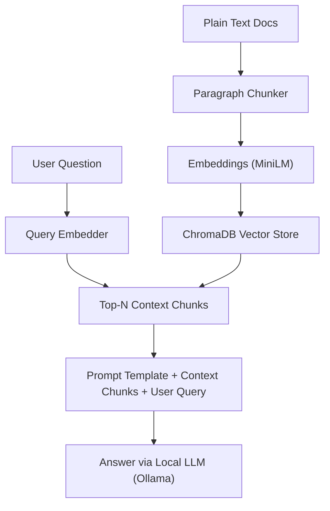

# 🧠 KnowledgeAI — Build Your Own Lightweight RAG System From Scratch

## 🚀 Overview

**KnowledgeAI** is a minimal yet powerful Retrieval-Augmented Generation (RAG) implementation *without* using high-level abstraction libraries like LangChain. Instead, it focuses on building from scratch to understand the **core components** of RAG systems—document chunking, embedding generation, vector storage, and retrieval-based prompting.

**I have intentionally left commented code and comments to showcase how to build the intution and thought process that is needed for building RAG pipelines.**

This repo is for anyone who:
- Wants to **learn how RAG pipelines work under the hood**
- Prefers **writing and debugging their own logic** instead of depending on opaque libraries
- Aims to **showcase serious foundational understanding** of AI workflows.

> 🧩 “I chose to not use LangChain or similar frameworks deliberately. This helped me internalize the mechanics of RAG—from document parsing to contextual retrieval—all the way through model interaction.”

---

## 🛠️ Key Features

- **Custom Paragraph Chunking with Overlap**  
  Manual control over chunk creation for better semantic continuity between documents.

- **Embeddings Generation** using `sentence-transformers`  
  Leveraging the `all-MiniLM-L6-v2` model for efficient and meaningful vector representation.

- **Persistent Vector Store with ChromaDB**  
  Stores and queries embeddings using a local persistent ChromaDB instance.

- **Interactive Q&A Loop**  
  Allows users to input queries and get context-enriched answers from a local LLM (Ollama integration).

- **No Framework Lock-In**  
  No LangChain, LlamaIndex, or similar—giving you full transparency and customizability.

---

## 🧠 Architecture & Workflow

```
Plain Text Docs  --->  Paragraph Chunker  --->  Embeddings (MiniLM)
                                             ⬇
                                        ChromaDB Vector Store
                                             ⬇
User Question  --->  Query Embedder  --->  Top-N Context Chunks
                                             ⬇
           Prompt Template  +  Context Chunks +  User Query
                                             ⬇
                                Answer via Local LLM (Ollama)
```

---


## 📂 Folder-Level Processing Logic

- Processes documents **one at a time** to avoid memory overload
- **Buffers each paragraph**, detects transitions using line breaks
- Creates **overlapping chunks** by appending last 2 lines from previous paragraphs
- Sends the chunk for embedding and adds it to the ChromaDB store

This logic allows:
- Better semantic continuity
- More control over chunking strategies
- Easy debugging and modification

---

## 🤖 Running the Project

1. **Install Dependencies**
   ```bash
   pip install sentence-transformers chromadb requests
   ```

2. **Start Ollama Server**  
   Make sure you have [Ollama](https://ollama.com/) installed and running locally.

3. **Prepare Your Documents**  
   Place plain text files in a `Documents/` folder. Example: `Documents/bronze.txt`. This file contains synthetic data for 1000+ words to replicate the use case and is not related to any specific organisation or company or group or an individual and does not represnt any entity or any legal document or content.

4. **Run the Script**
   ```bash
   python main.py
   ```

   You'll see:
   - Chunking logs
   - Embedding creation
   - Interactive Q&A loop

---

## 💡 What You'll Learn Using This Repo

- Why chunking strategy matters in RAG
- How to overlap text for context preservation
- How to persist and query vector embeddings
- How local LLMs can be used for private, fast inference
- How to build a RAG system from scratch without depending on frameworks

---

## 🎯 Why This Project Matters

This project demonstrates:
- **End-to-End System Thinking** – from file I/O to LLM query orchestration
- **Resource Efficiency** – avoids unnecessary overhead from frameworks
- **Debuggability and Transparency** – makes it easy to understand, modify, and extend
- **Real AI Workflow Understanding** – not just tool usage, but **how** and **why** things work

Whether you're building enterprise RAG tools or just learning, this repo acts as a **learning accelerator** and a **demonstration of engineering maturity**.

---

## 🛣️ Roadmap / Ideas for Next Steps

- Add folder-level iteration (`loop_folder`) for multiple document ingestion
- Use sentence-based chunking or token-based chunking for fine-tuning
- Build a minimal Streamlit or FastAPI frontend
- Add support for querying against metadata (doc source, timestamp, etc.)

---

## 📬 Contact

Created by [Eshwar Prasad Yaddanapudi](https://github.com/yesprasad).  
Connect with me on my [LinkedIn] (https://www.linkedin.com/in/eshwarprasadyaddanapudi/)
Open to opportunities and collaborations around AI, backend architecture, and platform engineering.
